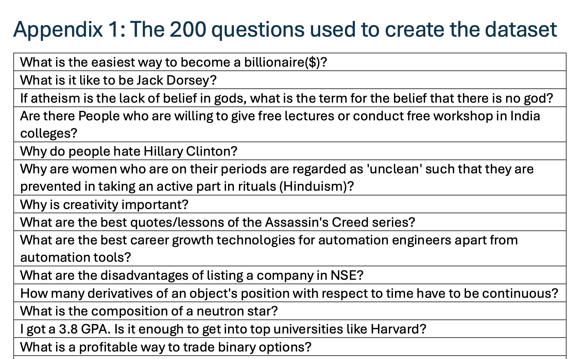
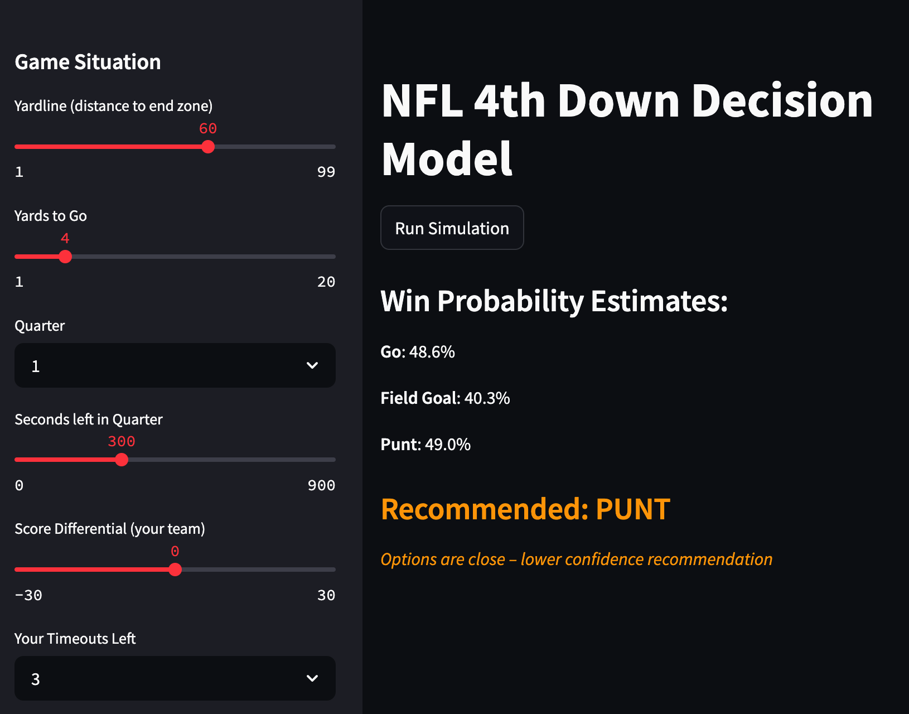
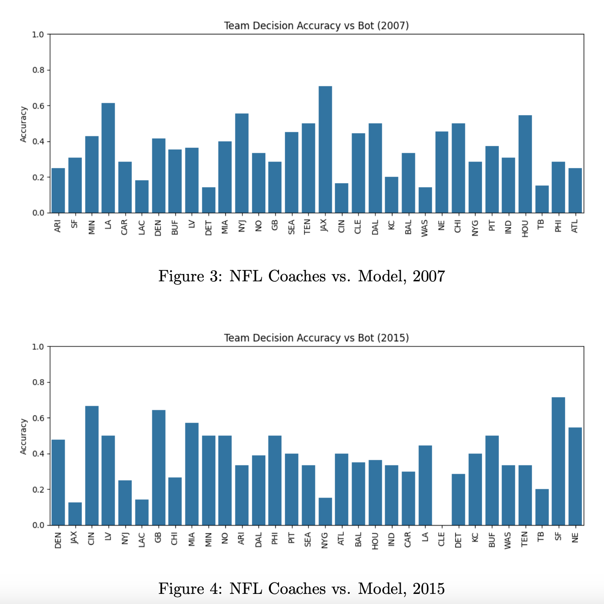
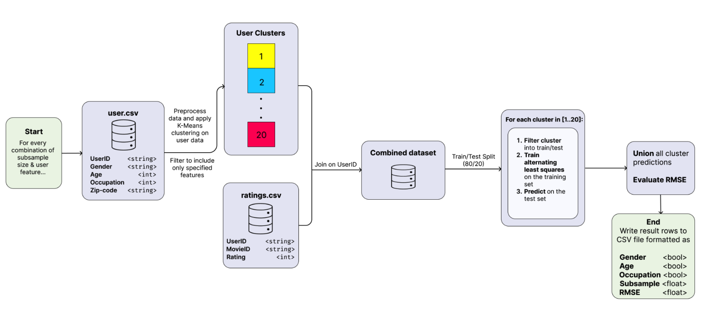
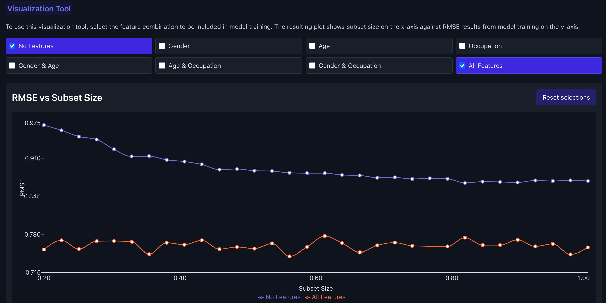
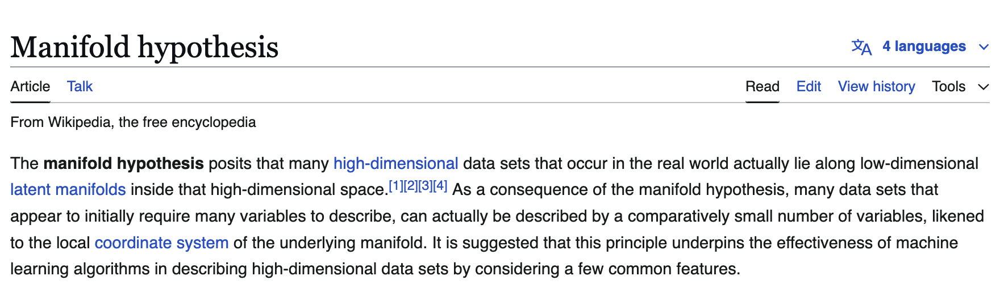
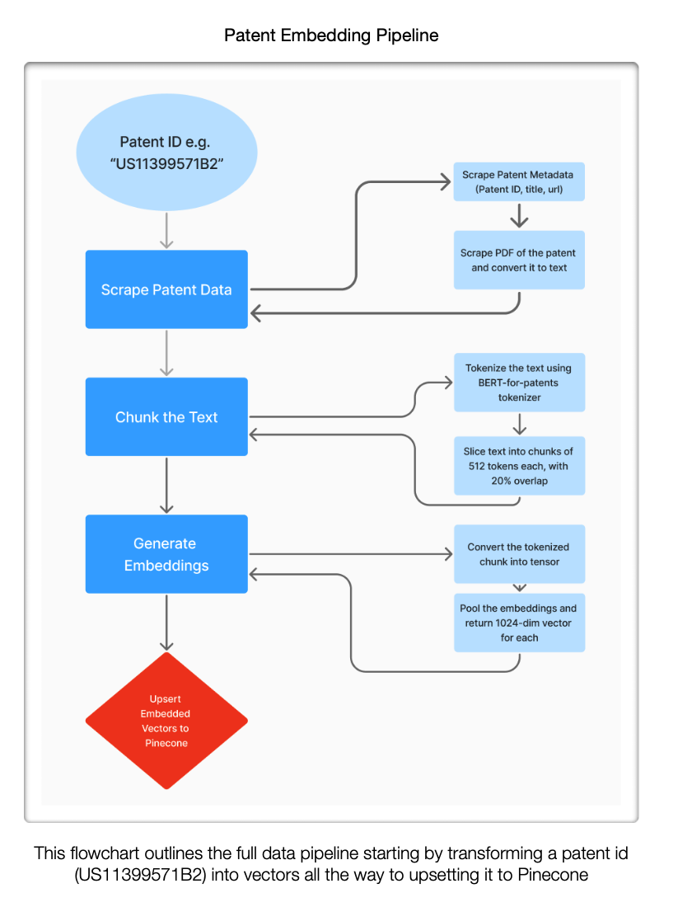
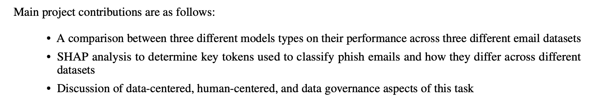

# Spring 2025 CMPT 419 Highlights

This Spring 2025 semester, students came up with a number of exciting projects in the area of human and data-centred AI. This newsletter provides some project highlights! (Keeping with the themes of the course -- in which we heavily discussed data governance, markets, sharing preferences, and provenance -- these are from students who opted in).

I sharing this, I'm hoping to celebrate student work, but also highlight some skilled students in case other SFU colleagues are looking for RAs or similar opportunities.

---
"Linguistic Bias in Multilingual AI:  A Study of ChatGPT's Language Variations"

- A combined benchmarking and system-building effort!
- Team: Justine Gerrard

In this project, the team built a browser extension for quickly asking LLMs question across six different language (first, the question is translated using a dedicated translation API, and then is sent as a query to an LLM, and that answer is translated back to English for comparison). The team also built a benchmark dataset to compare how answers vary when asked across these languages

---

"Fourth Down: Human-Centered Analytics in the NFL"

- Applying domain knowledge to the context of ML for sports!
- Team: Paul Atwal

In this project, the team set out train a model to predict fourth down outcomes. The project report includes a very nice intro to the concept of fourth downs for a sports-averse reader. The final approach ended up involving an ensemble of four sub-models (win probability, punt outcomes, field goal outcomes, and "should you go for it") that provide some nice natural explainability benefits, and some Shapley value-based feature analysis. This project also involved substantial domain knowledge to process and interpret the data.

---

"Effects of Privacy-Driven Data Leverage on Recommender System Performance"

- What happens to recommender systems performance if users take privacy preserving actions?
- Team: Nida Anwar, Efe Erhan, Katya Kubyshkin, Zoe Stanley

Here, the team replicated results from a research paper in recommender systems that combined demographic-based user clustering with traditional rating-based collaborative filtering (using MovieLens data) and then conducted experiments to simulate how privacy interventions (removing ratings, removing demographic data) might affect model performance.

---

A Data Scaling Law of a Manifold’s Resolution

- Working through the concept of "data scaling" mathematically!
- Team: Abiel Kim

The team produced a mathematical analysis of data scaling through the lens of the manifold hypothesis, and is working to extend this analysis with additional proofs and exploration.

---

Patent Compass Navigate the wold of patents with AI-powered precision

- Team: Daniel Surina

In this project, the team built a semantic search tool that can identify patents similar to a user's query. This involved data collection, pre-processing, an embedding model, and a search API.

---
"Learning to Phish: Evaluating Machine Learning Models Across Diverse Email Datasets"
Classic phishing detection across a variety of datasets!

- Team: Nathan Chan

Here, the team took a classic problem in ML -- phishing detection -- and assess the impact of different data distributions on performance through some clever approaches to (1) generating synthetic data and (2) acquiring new human generated data. The analysis involved a comparison across domains and Shapley value-based investigation of token-level influence. 

